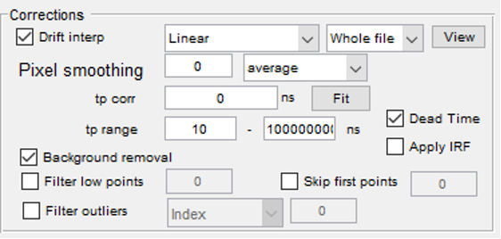

# TRAST Imaging Software Suite Documentation  
**Version**: 3.5

---

**Software Components**:  
- **TriIm** (TRAST Imaging Acquisition Software)  
- **TriFit** (TRAST Data Analysis Software)

**Manual Authors**: 
- **Experimental Biomolecular Physics KTH**
- **Joachim Piguet**
- **Haichun Liu**  


**Institution**:  
Department of Applied Physics  
KTH Royal Institute of Technology  
Stockholm, Sweden

**Contact Information**:  
For support, inquiries, or access to the software, please contact:  
- Email: **jpiguet@kth.se**  **haichun@kth.se**
- Website: [KTH - Applied Physics - Biomolecular Physics](https://www.biomolphysics.kth.se)

## Introduction

The **TRAST Imaging Software Suite** consists of two main components: **TriIm** and **TriFit**, designed to facilitate data acquisition and analysis in **TRAST** (Transient State Imaging) experiments. Together, these tools streamline the process of acquiring, processing, and analyzing TRAST data, offering a user-friendly interface and flexible options for advanced users. This manual provides step-by-step instructions on how to install, configure, and use both **TriIm** and **TriFit**, ensuring an efficient workflow for data acquisition and analysis.

### TriIm

**TriIm** is the primary acquisition software for **TRAST experiments**, responsible for controlling hardware and managing data acquisition. It provides a comprehensive **GUI** and API support for users, enabling them to interact with various components of the system, including detectors, lasers, and pulse generators. **TriIm** is designed to work with multiple hardware configurations, such as **NI DAQ** and various camera systems, offering flexibility for different experimental setups.

### TriFit

**TriFit** complements **TriIm** by focusing on data analysis. After data is acquired through **TriIm**, it is processed and fitted using **TriFit**. The software allows users to load, process, and fit TRAST data using photophysical models, perform corrections, and simulate beam profiles. With its intuitive interface, **TriFit** enables detailed data examination, fitting, and troubleshooting, ensuring high-quality analysis of TRAST measurements.

### Structure of the Manuals

Both manuals follow a similar structure to ensure ease of use and consistency in operation between the two tools:

1. **Installation**: Step-by-step guidance on how to install and set up the software.
2. **Usage**: Detailed instructions for each software component, from loading data to advanced settings.
3. **Panels and Interface**: A breakdown of the GUI and its various panels for ease of navigation and control.
4. **Data Processing**: A guide on how to handle and process data, including selecting regions of interest (ROI), applying corrections, and performing curve fitting.
5. **Troubleshooting**: A section dedicated to common issues and their solutions, ensuring smooth operation.

---

### Target Audience

This documentation is intended for users with a basic understanding of **TRAST** experiments, data acquisition, and analysis. Whether you are new to the software or an advanced user, these guides provide all the necessary information to ensure successful use of both **TriIm** and **TriFit**.

---

### Installation

Running **TriIm** requires **Matlab 2013b** to **2015b**.
Running **TriFit** requires **Matlab 2019b** to **last**.

The software can be installed via GitHub after requesting access from **jpiguet@kth.se**:

```bash
$ git clone https://gitr.sys.kth.se/jpiguet/TRAST.git
```

The resulting folder should then be added to the **Matlab** path.

---


## TriIm (TRAST Imaging Software) v3.5 Documentation

### About

The **TriIm** subroutine contains a **GUI** and **APIs** to interact with the different components necessary for **TRAST** data acquisition.

**TriIm** supports the **Windows operating system** and **Matlab 2015b**. Some components of the system may not work with later versions of **Matlab**.

### Features

The following is a non-exhaustive list of the current features of **TriIm 3.4**:
- **GUI** with all necessary functions for data acquisition.
- Wrapper for **NI DAQ**.
- Pulse generator (NI DAQ-based).
- **SPAD** counting.
- Wrapper for **Hamamatsu camera control**.
- Wrapper for **Andor Luca control**.
- Wrapper for **Laser control** (Cobolt) – bug detected.
- Error management.
- Laser setup.
- Camera setup.
- Measurement setup features:
    - Objective.
    - Laser.
    - Tube lens.
    - Excitation efficiency.
    - Detection.
    - Dye features (lifetime, cross-section at the laser's wavelength).

---

### Usage

#### Initialization
1. Add the **TRAST software** to the **Matlab** path.
2. Start **TriIm** in the **Matlab** console.

---

### First Panel: Measurement System Setup


1. **Select Setup**  
   Choose the setup. It will load the available parameters.

2. **Select Detector**  
   Choose between a camera and a single-point detector, which will load the corresponding wrapper.

3. **Select Configuration File**  
   The configuration file is a text file containing initial values for measurements. The standard one is in **+TriConfig/**, but it can be stored anywhere.

4. **Set Acquisition Interface**  
   The default is **NI DAQ**, but it can be changed if necessary.

5. **Select Detector**
   Choose a camera or DAQ

6. **Set the Number of Detector**
   Used with the multicamera system. In all other cases leave on **1**.

7. **Set Objective**  
   The objective selection affects pixel size and **PSF** and adjusts the available excitation power. Check which objective is installed on the microscope.

8. **Laser Selection**  
   The selected wavelength is saved in the metadata. Cobolt lasers can be controlled from the app, but there is a bug on some Windows versions that disconnects the lasers. Use **option 9** to deactivate the laser control if it is not working.

9. **Laser Offline**  
   This option disables the loading of the laser controller.

10. **Choose Dye**  
   The dye choice is important for analysis, as its parameters are stored in the metadata.

11. **Load**  
   - **Start without Loading**: Load a simulated setup to test configurations.
   - **Load** load the setup and connect to all the required components.

---

### Overview of TriIm Panels

**TriIm** consists of four panels. Most acquisition parameters are set in **Panel 1**.


---

#### Panel 1 – Experiment Control

**Panel 1** consists of six frames, each controlling a specific part of the experiment:
- Save location and comments.
- Pulse generation.
- Detection.
- Lasers.
- Advanced controls.
- Acquisition control.


---

### Detailed Panel Descriptions

#### Panel 1 – Save Location and Comments
- Set the path for generated files.
- Add the base name for the experiment. **TriIm** automatically adds a sequential termination to file names.
- Comments are stored in the metadata for each measurement.


#### Panel 1 – Pulse Train Control
This is the core of **TRAST** experiments.


1. **Pulse Width (A)**  
   Set evenly in a logarithmic space using **logspace**. The arguments are: start, end, and the number of points. Example: 30 points from 100 to 1,000,000. Generally, 30 points are used, with up to 107 depending on the process.

2. **Duty Cycle (B)**  
   Start with 1% (0.01). The system needs time to relax between pulses.

3. **Illumination Time (C)**  
   The total time the laser will be on during a pulse train.

4. **Pause (D)**  
   A 2-second pause ensures molecules relax and detectors reset between pulse trains.

5. **Pulse Mode (E)**  
   Modify the pulse shape.

6. **Pulse Order (F)**  
   Choose between **Direct**, **Reverse**, and **Scrambled** pulse orders. **Scrambled** is useful for time-sensitive samples.

7. **Bleaching References (G)**  
   Set after 3 pulse trains (value = 4) to correct the **TRAST** curve for photobleaching.

8. **Pre-exposures (H)**  
   Use with caution if dyes accumulate on surfaces.

#### Panel 1 – Camera Control


- Adjust **EM-CCD** gain and image resolution. These should remain constant during analysis.

#### Panel 1 – Laser Control
- The system can control Cobolt lasers. 


#### Panel 1 – Advanced Controls


- **CW**: Activates the **NI-DAQ** output.   
- **DIC Acq**: Transmission acquisition.
- **Live Acq**: Reads images from **Hamamatsu cameras**.
- **Tp Manager**: Custom pulse widths.

#### Panel 1 – Acquisition Control


- Set acquisition to single or repeated measures.
- **# acq**: Number of repeats for multiple measures.
- **Pause**: Allows the experimenter time to exit the room or turn off the computer screen.
- **Test Experiment**: Runs the shortest pulse train to check for errors.
- **Start**: Begins the experiment. Can be aborted between pulse trains.

---

#### Panel 2 – Measurement Parameters
Add additional parameters such as concentration, timing, ligand, quencher, or oxygen.

---

#### Panel 3 – Camera Display
Displays the camera image, background, or the first reference image. Can support up to 2 **Hamamatsu** cameras.

---

#### Panel 4 – Data Display
Shows current measurement data. Limited functionality for viewing the **TRAST curve** during acquisition.

---

### Running Experiment

#### Step 1 - Set and Test Experimental Conditions

1. Adjust the parameters according to the planned experiment.
2. Add a meaningful name in the name field of Panel 1.
3. If necessary add additional data on the measurment in Panel 2.
4. Test the system using **Test Experiment**. In case of error, check the parameters for inconsticency.
5. Panel 3 will display an image of the sample.
   - In case of saturation, add OD filters in the detection pathway. If possible, reduce the concentration of the fluorescent specie.
   - In case of low signal, remove OD filter in the detection pathway. If possible, increase the concentration of the fluorescent specie.

#### Step 2 - Run Experiment

1. Work in darkness. 
   
   **Note**: It is important to avoid background light of the lab and from the setup at a minimal and constant intensity. TRAST experiment are very sensitive to background changes 
2. Start thee experiment using the **Start** function in Panel 1. Each datapoint is measured independently. The system cannot be stopped during an acquisition step.
3. During the experiment the TRAST values and the bleaching curves are shown in Panel 4. It displays raw data. One should not worry about strange shape of the curves.
3. At the end of the experiment, data are saved in the selected folder. Data is save in two files:
   - \*.data is a Matlab data file containing all the camera frames acquired during the experiment
   - \*.trast is a Matlab metadata file containing all the information about the measurment (including all the settings)

#### Example - Cy5-mono-NHS in water

---

## TriFit 3.4 Manual
**Author**: Haichun Liu

### About

The **TriFit** subroutine contains a **GUI** and all functions necessary for **TRAST** data analysis.

**TriIm** supports the **Windows operating system** and **Matlab 2019b**. Some components of the system may not work with earlier versions of **Matlab**.

### Features

The following is a non-exhaustive list of the current features of **TriFit 3.5**:
- **GUI** with all necessary functions for data analysis.
   - A ROI selector
   - An excitation beam profiler
   - TRAST data computation module
   - Fitting function for TRAST data
   - Results export functions
   - User Macros for metadata management

---

### Usage

#### I. Load Data

1. **Load Raw Data**  
   In the **Data** section, select the folder containing the data to be analyzed. All files with the suffix **.trast** will be loaded.

   

2. **Load Data to Processing Zone**  
   Select the files to be analyzed and click the **v** button to load data into the processing zone.  
   - Under **Settings**, choose **Group files when loading** → **Based on file index**. Files measured under the same condition will be averaged and saved with the suffix **.fit**.

   

3. **Processing Zones**  
   There are five processing zones available. Data from different experiments can be placed in different zones.  
   - Data loaded into the processing zone can be removed by clicking the remove (^) button.

---

#### II. Select the ROI (Region of Interest)

1. After loading the data, define the **ROI** by clicking the **ROI Editor** button.


2. In the **ROI Editor GUI**:
   - Under **Region** (upper left corner), select region selection tools (e.g., **New Rectangle**: Ctrl+1, **New Ellipse**: Ctrl+2, **New Polygon**: Ctrl+3).  
   - The **New Ellipse** tool is often used. Adjust the position and size of the ROI by dragging the cursor.
   - The ROI is typically selected near the intensity maximum.

3. After selecting the ROI, click **Add new ROI**. You can name the ROI and save it by clicking **OK**.

4. To apply the ROI to other files in the same series:
   - Click **Copy**, multi-select other data files, and then click **Paste**.
   - Click **Recalculate Selected** to apply the ROI. This may take some time.

---

#### III. Excitation Beam Profile Simulation

1. This should be done with an image measured under conditions without prominent dark state populations (e.g., low excitation power, no significant dark state population).
   
2. In **Model**, click **Add** and select **Proportional**.


3. In **Simulation**, choose **3D** for **Beam Shape** and **None** for **Averaging**.


4. In **Grid**, click **Select Center** or **Find the Center** to define the laser beam centroid. The x and y coordinates will be highlighted.


   - Click **Apply to Selected** to apply the generated coordinates.  

5. Set initial values for **wax** and **way** in **Beam Profile (1/e² radius)** (typically around 18 µm).


   - Click **Apply to Selected** again to use these values in subsequent steps.

6. Go to **Grid Editor**

7. In **Grid Selector** GUI, set the grid values:
   - Typical values: **rx = 40**, **dx = 1**, **ry = 40**, **dy = 1**, **rz = 100**, **dz = 0.1**.

   

   - Click **Recalc** to calculate the grid and save it by clicking **Save Grid**.

   

- Click **Apply to Selected** to apply the excitation profile to other data files.

8. Select the **Proportional** model and **3D** beam shape. Use **None** for **Averaging**.

8. Select **Weighted Star** and click **Fit Profile** to return the most approximate excitation profile.  
   - Click **Apply to Selected** to apply the excitation profile to other data files.

---

#### IV. Data Corrections Before Fitting with a Photophysical Model




1. **Drift Interpolation**  
   Use **piecewise_linear** for the whole file to correct for photobleaching.

2. **Adjust tp Range**  
   Constrain the fitting range using the **tp range**.

3. **Background Removal**  
   Tick the **Background Removal** box to remove detector dark counts.

---

#### V. TRAST Curves Fitting with a Photophysical Model

1. **Select Photophysical Model**  
   Choose a photophysical model (e.g., **Exponential_1**) for the current fluorophore.

2. **Set Initial Rates**  
   Click **Set Init Rates** to open the **Rate Editor** and set the initial values for parameters.

   

   - **Fix or Global Parameters**  
   Tick **Fix** to fix a parameter value or **Global** to apply it across all files being fitted.

   - **Lifetime Settings**  
   Tick **Lifetime from Sample Metadata** to use pre-measured lifetime or **Fluorescence Decay Correction** to use **IRF** for lifetime measurement.

3. **Averaging and Normalization**  
   Select **ROI Average** for **Averaging** and **Norm to 1** for **Norm Mode** to normalize the TRAST curve.

4. **Fit Algorithm**  
   
   

   - Select **trust-region-reflective** for the fitting algorithm.  
   - Set **TolFun** and **TolX** to define stopping criteria.
   - Set **MaxIter** for the maximum number of iterations (typically 1000).

7. **Series Mode**  
   Choose between **Single**, **Series**, or **WF Power** for the fitting mode.  
   - In **Single** mode, each data file is fitted one by one.  
   - In **Series** mode, files are fitted with consideration of their correlations.

8. **View Fitted Rates**  
   Tick different options to control the displayed items (e.g., **Legend**, **Residuals**) in the graph.

   

9. **New Photophysical Models**
   The folder “+TriModels” contains all the photophysical models. New photophysical models can be made by creating new Matlab codes in this folder. Afte the creation, the new model is available in “Model”.

---

#### VI. Troubleshooting

1. **No Data for Some TRAST Measurements**  
   This could be due to poor data quality. After selecting an ROI, the **TRAST** curve is generated from the raw images. If the data quality in the ROI is poor, the **TRAST** curve cannot be calculated correctly. In this case, review the individual data files related to the "No data" issue.
